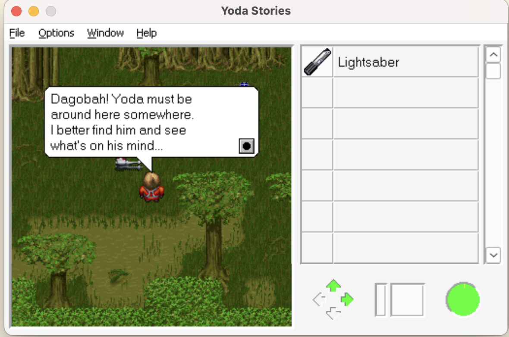

# Yodecomp

AKA, let's see how well Claude can decompile Yoda Stories with the right encouragement



## Current Progress

Claude has successfully transcribed 100% of the engine into idiomatic C++, and is able to build an EXE from source (see `build_run.sh`). It's currently working on getting the engine to 100% bytematching status.

## Methodology

I started by seeding Opus with the game assets, `Yodesk.exe` loaded into Ghidra (accessible via MCP/curl), the source code to `OpenJKDF2` and `DesktopAdventures` as a reference (particularly for asset loading code and scripting documentation I had already done), as well as a basic initial plan in `CLAUDE.md`:

```
## Decompiling
A decompiler instance can be accessed via `http://localhost:8089`, which is running an instance of https://github.com/bethington/ghidra-mcp. The binary that should be accessed is `YodaDemo.exe`, which can also be found at `YodaDemo/YodaDemo.exe`.

Examples:
`http://localhost:8089/list_functions` - Lists all the functions in the currently loaded binary.
`http://localhost:8089/decompile_function?address=sithThing_sub_4CCE60` - Decompiles `sithThing_sub_4CCE60`.

## High-Level Requirements Remaining
 - Comb through every function in Ghidra and identify each compile unit -- code that is nearby each other tends to be in the same object
 - Document structures and function signatures as well as possible
 - Identify the exact Visual C++ version, and download a copy of it to this project folder 
 - Set up a CMake toolchain for this Visual C++ version, using `wine` to invoke it 
 - Decompile one function with a successful bytematch
```

From there, I mostly let Claude steer, but occasionally offered it advice if I saw something that looked inefficient or incorrect. For instance, I explicitly outlined a reverse engineering "Maybe" naming strategy (which I myself use) that helped it refine its documentation, because I saw it naming things too confidently (and incorrectly). I also had to explicitly keep it from only documenting structs in md files instead of in Ghidra.

It eventually settled on a phasing and pick-up task protocol in CLAUDE.md to help manage context limitations, so every session can be picked up from an empty context and context cleared at the end. It seems to work fairly well, though I still drove it manually rather than trying to loop it in an automated fashion.

I occasionally used Fable since it was available, and it seems to have been a primary driver in the structured protocol and suggestions in CLAUDE.md. However, Opus is perfectly adequate with manual guidance and the given pick-up tasking structure.
